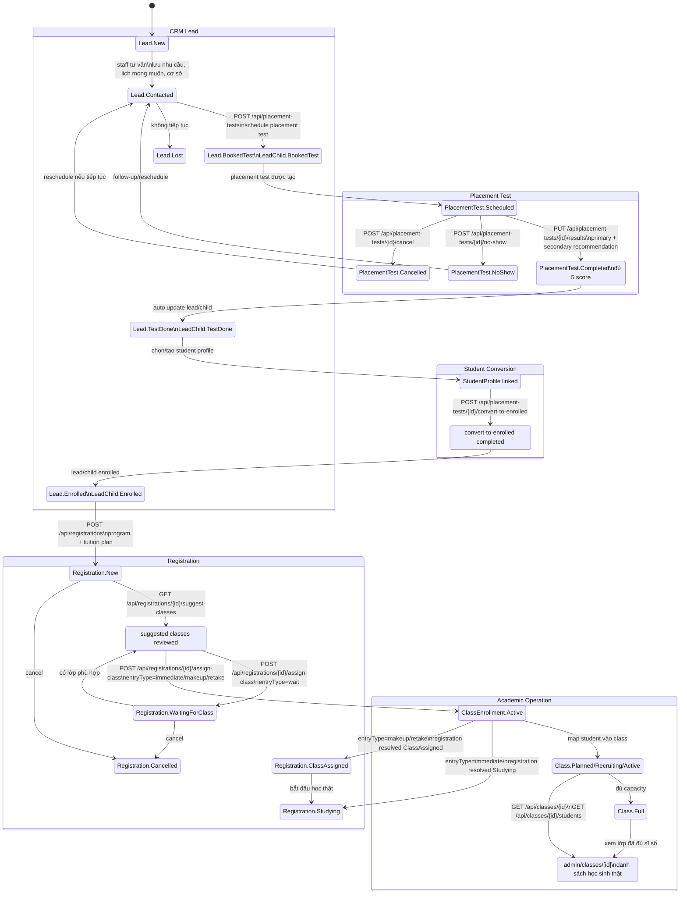
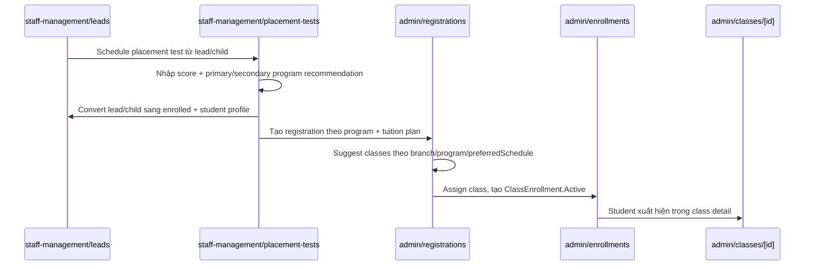
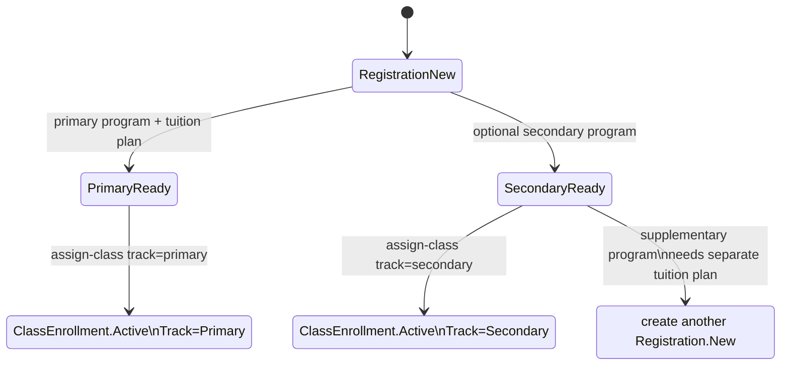

# Flow 1 State Diagram Guide: Tuyển sinh -> Placement -> Registration -> Xếp lớp

Ngày tạo: `2026-04-17`

## 1. Mục tiêu tài liệu

Tài liệu này hướng dẫn cách vẽ state diagram cho Flow 1:

```text
Lead tuyển sinh -> Placement test -> Registration -> Enrollment -> Class detail
```

Thông điệp cần thể hiện khi demo:

> Flow 1 cho thấy hệ thống không dừng ở CRM, mà đi xuyên sang học vụ.

Route demo gợi ý:

```text
staff-management/leads
-> staff-management/placement-tests
-> admin/registrations
-> admin/enrollments
-> admin/courses
-> admin/rooms
-> admin/schedule
-> admin/classes/[id]
```

Khi vẽ, không nên chỉ vẽ các màn hình. State diagram cần cho thấy một lead ban đầu được biến đổi thành dữ liệu học vụ thật:

- nhu cầu học, lịch mong muốn, cơ sở mong muốn
- lịch placement test và kết quả kiểm tra
- chương trình chính và chương trình phụ nếu có
- registration theo package học tập
- enrollment thật vào lớp
- chương trình, học phí, phòng học, lịch học
- class detail có danh sách học sinh thật

## 2. Cách chia state diagram

Nên chia diagram thành 5 cụm state lớn:

| Cụm | Ý nghĩa | Entity chính | Route live |
| --- | --- | --- | --- |
| CRM Lead | Thu thập nhu cầu ban đầu | `Lead`, `LeadChild` | `staff-management/leads` |
| Placement | Đặt lịch, chấm trình độ, đề xuất chương trình | `PlacementTest` | `staff-management/placement-tests` |
| Conversion | Gắn lead/child với student profile | `Profile`, `LeadChild.ConvertedStudentProfileId` | từ placement test detail |
| Registration | Chọn program, tuition plan, lịch mong muốn, chờ/xếp lớp | `Registration` | `admin/registrations` |
| Academic Operation | Enrollment, lớp, phòng, lịch học, sĩ số thật | `ClassEnrollment`, `Class` | `admin/enrollments`, `admin/classes/[id]` |

Gợi ý bố cục:

```text
[CRM] -> [Placement] -> [Registration] -> [Enrollment/Class]
```

Với mỗi cụm, vẽ state theo trạng thái nghiệp vụ thật, không vẽ mọi API nhỏ. Các API và route nên đặt trên mũi tên để người xem hiểu thao tác nào làm state đổi.

## 3. State chính cần vẽ

### 3.1. Lead và LeadChild

Status hiện có:

| Entity | Status | Khi nào dùng trong flow |
| --- | --- | --- |
| `Lead` | `New` | Lead mới được tạo từ form hoặc nhập nội bộ. |
| `Lead` | `Contacted` | Staff đã tư vấn/liên hệ. |
| `Lead` | `BookedTest` | Đã đặt lịch placement test. |
| `Lead` | `TestDone` | Placement test đã đủ kết quả. |
| `Lead` | `Enrolled` | Lead đã được chuyển sang học viên/enrollment flow. |
| `Lead` | `Lost` | Lead thất bại, rời khỏi flow chính. |
| `LeadChild` | `New` | Child mới trong lead. |
| `LeadChild` | `BookedTest` | Child đã được đặt lịch test. |
| `LeadChild` | `TestDone` | Child đã hoàn tất test. |
| `LeadChild` | `Enrolled` | Child đã được map sang student profile. |
| `LeadChild` | `Lost` | Child không tiếp tục. |

Cách vẽ:

- Bắt đầu bằng `Lead.New`.
- Sau khi staff tư vấn, chuyển sang `Lead.Contacted`.
- Khi schedule placement test, cả `Lead` và `LeadChild` chuyển sang `BookedTest`.
- Khi nhập đủ kết quả placement test, `Lead`/`LeadChild` chuyển sang `TestDone`.
- Khi convert lead/child sang enrolled, chuyển sang `Enrolled`.

Dữ liệu nên annotate trong state `Lead.Contacted` hoặc trên transition `New -> Contacted`:

- `BranchPreference`: cơ sở mong muốn.
- `LeadChild.ProgramInterest`: nhu cầu/chương trình quan tâm ban đầu.
- `Lead.Notes`, `LeadChild.Notes`: nhu cầu học, ca học mong muốn, thông tin tư vấn.
- `NextActionAt`, activity/note: lịch chăm sóc.

### 3.2. PlacementTest

Status hiện có:

| Status | Ý nghĩa |
| --- | --- |
| `Scheduled` | Đã đặt lịch kiểm tra. |
| `Completed` | Đã nhập đủ điểm và có thể đề xuất chương trình. |
| `NoShow` | Học sinh không đến kiểm tra. |
| `Cancelled` | Hủy lịch kiểm tra. |

Cách vẽ:

```text
Placement.Scheduled
  -> Placement.Completed
  -> ConvertToEnrolled
```

Các nhánh phụ:

```text
Placement.Scheduled -> Placement.NoShow
Placement.Scheduled -> Placement.Cancelled
```

Dữ liệu phải thể hiện ở state `Placement.Completed`:

- `ListeningScore`
- `SpeakingScore`
- `ReadingScore`
- `WritingScore`
- `ResultScore`
- `ProgramRecommendationId`: chương trình chính được đề xuất
- `SecondaryProgramRecommendationId`: chương trình phụ nếu có
- `SecondaryProgramSkillFocus`: kỹ năng cần tập trung cho chương trình phụ
- `AttachmentUrl`: file/kết quả đính kèm nếu có

Ghi chú quan trọng:

- Placement test chỉ chuyển `Completed` khi đủ 5 score: listening, speaking, reading, writing, result.
- Primary program và secondary program không được trùng nhau.
- Nếu secondary program là chương trình supplementary có tuition plan riêng, hiện backend yêu cầu tạo registration riêng thay vì nhét chung vào `SecondaryProgramId`.

### 3.3. Registration

Status hiện có:

| Status | Ý nghĩa trong state diagram |
| --- | --- |
| `New` | Registration vừa tạo, đã có student, branch, program, tuition plan. |
| `WaitingForClass` | Chưa có lớp phù hợp hoặc chọn entry type `wait`. |
| `ClassAssigned` | Đã có lớp nhưng chưa học ngay, ví dụ `makeup` hoặc `retake`. |
| `Studying` | Đã tạo enrollment active, học sinh bắt đầu học. |
| `Paused` | Bảo lưu. |
| `Completed` | Học xong/hoàn tất registration. |
| `Cancelled` | Hủy registration. |

Cách vẽ flow chính:

```text
Registration.New
  -> Registration.WaitingForClass
  -> Registration.ClassAssigned
  -> Registration.Studying
```

Tùy thao tác xếp lớp, có 3 hướng:

| EntryType | Kết quả state | Có tạo `ClassEnrollment` không? | Khi nào dùng |
| --- | --- | --- | --- |
| `immediate` | `Studying` | Có, status `Active` | Vào lớp ngay. |
| `makeup` | `ClassAssigned` | Có, status `Active` | Có lớp nhưng cần học bù trước. |
| `retake` | `ClassAssigned` | Có, status `Active` | Thi lại để lên/chuyển chương trình. |
| `wait` | `WaitingForClass` | Không | Chưa có lớp phù hợp, đưa vào waiting list. |

Dữ liệu mapping từ placement sang registration:

| Placement/Lead | Registration |
| --- | --- |
| `StudentProfileId` sau convert | `StudentProfileId` |
| `Lead.BranchPreference` | `BranchId` |
| `ProgramRecommendationId` | `ProgramId` |
| Package học tập được chọn | `TuitionPlanId` |
| Nhu cầu lịch học từ tư vấn | `PreferredSchedule` |
| `SecondaryProgramRecommendationId` | `SecondaryProgramId`, nếu không phải supplementary riêng |
| `SecondaryProgramSkillFocus` | `SecondaryProgramSkillFocus` |
| Ghi chú tư vấn/kết quả test | `Note` |

### 3.4. Enrollment và Class

State cần vẽ:

| Entity | State | Ý nghĩa |
| --- | --- | --- |
| `ClassEnrollment` | `Active` | Học sinh đã được ghi danh thật vào lớp. |
| `ClassEnrollment` | `Paused` | Enrollment tạm dừng. |
| `ClassEnrollment` | `Dropped` | Học sinh đã rời lớp. |
| `Class` | `Planned` | Lớp đã lên kế hoạch. |
| `Class` | `Recruiting` | Lớp đang tuyển sinh. |
| `Class` | `Active` | Lớp đang học. |
| `Class` | `Full` | Lớp đủ sĩ số. |
| `Class` | `Completed` hoặc `Closed` | Lớp kết thúc. |
| `Class` | `Suspended` | Lớp tạm ngưng. |
| `Class` | `Cancelled` | Lớp bị hủy. |

Khi `POST /api/registrations/{id}/assign-class` với `entryType = immediate/makeup/retake`:

- tạo `ClassEnrollment`
- set `ClassEnrollment.Status = Active`
- set `ClassEnrollment.TuitionPlanId = Registration.TuitionPlanId`
- set `ClassEnrollment.Track = primary` hoặc `secondary`
- validate class cùng program với registration track
- validate class còn chỗ
- validate conflict lịch học
- sync session assignments cho học sinh
- nếu đủ sĩ số thì class có thể thành `Full`

State `ClassDetail` nên là điểm chốt của diagram:

```text
ClassDetail: lớp thật
ClassDetail: room thật
ClassDetail: schedulePattern thật
ClassDetail: active enrollment thật
ClassDetail: danh sách học sinh thật
```

## 4. Mermaid state diagram đề xuất

Có thể copy block dưới vào Markdown hoặc Mermaid Live Editor.



## 5. Mermaid sequence ngắn để đặt cạnh state diagram

State diagram cho thấy trạng thái, còn sequence ngắn giúp người xem hiểu thao tác demo đi qua màn hình nào.



## 6. Bảng transition chi tiết

| Từ state | Sang state | Trigger/API | Điều kiện chính | Dữ liệu nên highlight |
| --- | --- | --- | --- | --- |
| `Lead.New` | `Lead.Contacted` | Staff cập nhật lead/note/status | Lead có thông tin phụ huynh/học sinh | nhu cầu học, lịch mong muốn, cơ sở mong muốn |
| `Lead.Contacted` | `Lead.BookedTest` | `POST /api/placement-tests` | Có `LeadId` hoặc `LeadChildId`, có phòng và giám thị | `ScheduledAt`, `RoomId`, `InvigilatorUserId` |
| `PlacementTest.Scheduled` | `PlacementTest.Completed` | `PUT /api/placement-tests/{id}/results` | Đủ 5 score | score, primary program, secondary program |
| `Lead.BookedTest` | `Lead.TestDone` | Auto sau placement completed | Lead đang `BookedTest` | activity note |
| `LeadChild.BookedTest` | `LeadChild.TestDone` | Auto sau placement completed | Child đang `BookedTest` | activity note |
| `Lead.TestDone` | `Lead.Enrolled` | `POST /api/placement-tests/{id}/convert-to-enrolled` | Có lead, có student profile nếu muốn link | `StudentProfileId` |
| `LeadChild.TestDone` | `LeadChild.Enrolled` | `POST /api/placement-tests/{id}/convert-to-enrolled` | Child chưa enrolled | `ConvertedStudentProfileId` |
| `Lead.Enrolled` | `Registration.New` | `POST /api/registrations` | Có student, branch, program, tuition plan | `ProgramId`, `TuitionPlanId`, `PreferredSchedule` |
| `Registration.New` | `ClassSuggested` | `GET /api/registrations/{id}/suggest-classes` | Có class cùng branch/program, còn chỗ | class, schedule, capacity |
| `ClassSuggested` | `ClassEnrollment.Active` | `POST /api/registrations/{id}/assign-class` | `entryType=immediate`, `makeup` hoặc `retake`, không conflict lịch | tạo enrollment active |
| `ClassEnrollment.Active` | `Registration.Studying` | Auto trong assign-class | `entryType=immediate` | registration được resolve sang đang học |
| `ClassEnrollment.Active` | `Registration.ClassAssigned` | Auto trong assign-class | `entryType=makeup` hoặc `retake` | có lớp, nhưng chưa coi là học ngay |
| `ClassSuggested` | `Registration.WaitingForClass` | `POST /api/registrations/{id}/assign-class` | `entryType=wait` hoặc chưa có lớp phù hợp | waiting list |
| `ClassEnrollment.Active` | `ClassDetail` | `GET /api/classes/{id}/students` | Student đã được enroll | danh sách học sinh thật |

## 7. Cách thể hiện primary và secondary program

Trong diagram, nên vẽ primary và secondary như hai track song song trong registration:

```text
Registration
  primary track:
    ProgramId -> ClassId -> ClassEnrollment(track=primary)

  secondary track:
    SecondaryProgramId -> SecondaryClassId -> ClassEnrollment(track=secondary)
```

Quy tắc thể hiện:

- Primary program là bắt buộc trong registration.
- Secondary program là tùy chọn.
- Secondary program phải khác primary program.
- Nếu secondary program là supplementary và cần tuition plan riêng, vẽ nhánh "Create separate registration" thay vì nối vào `SecondaryProgramId`.
- Khi assign class cho secondary track, class phải thuộc `SecondaryProgramId`.
- Nếu primary đã `immediate` nhưng secondary còn chờ lớp, registration tổng thể có thể vẫn cần thể hiện cả hai track để tránh hiểu nhầm rằng chỉ có một lớp.

Mẫu Mermaid track chi tiết:



## 8. Route live demo nên đi như thế nào

Kịch bản live nên ưu tiên mở dữ liệu đã có để tránh mất thời gian nhập.

| Bước live | Route | Người demo cần chỉ vào | State đang chứng minh |
| --- | --- | --- | --- |
| 1 | `staff-management/leads` | Lead có child, nhu cầu học, lịch mong muốn, cơ sở mong muốn | `Lead.New/Contacted` |
| 2 | Lead detail | Timeline/note, child info, branch preference | CRM đã có dữ liệu tư vấn |
| 3 | `staff-management/placement-tests` | Placement test của lead/child đã có kết quả | `PlacementTest.Completed` |
| 4 | Placement detail | Score, primary recommendation, secondary recommendation | Placement không chỉ chấm điểm mà đề xuất lộ trình |
| 5 | Placement detail hoặc action liên quan | Student profile linked/converted | `Lead.Enrolled`, `LeadChild.Enrolled` |
| 6 | `admin/registrations` | Registration theo student, program, tuition plan | `Registration.New` |
| 7 | Registration detail | Branch, preferred schedule, package học tập, secondary program nếu có | Dữ liệu tư vấn đã sang học vụ |
| 8 | Registration suggest/assign | Lớp gợi ý theo program/branch/lịch, assign class | `Studying` hoặc `ClassAssigned` |
| 9 | `admin/enrollments` | Enrollment active, tuition plan, track | Ghi danh thật |
| 10 | `admin/courses` | Program/course tương ứng | Map chương trình |
| 11 | `admin/rooms` | Room của class | Map phòng học |
| 12 | `admin/schedule` | Lịch học của lớp/học sinh | Map lịch học |
| 13 | `admin/classes/[id]` | Class detail + students list | Chốt: tư vấn đã thành lớp học thật |

Câu chốt khi đứng ở class detail:

```text
Từ một lead ban đầu, dữ liệu tư vấn đã đi qua placement, registration, enrollment,
và cuối cùng thành một lớp học thật có chương trình, học phí, phòng học,
lịch học và danh sách học sinh thật.
```

## 9. Checklist khi vẽ trong diagrams.net/Figma/Mermaid

Checklist nội dung:

- Có state mở đầu `Lead.New` hoặc `Lead.Contacted`.
- Có state `Lead.BookedTest` sau khi schedule placement.
- Có nhánh `Placement.NoShow` và `Placement.Cancelled` nhưng để phụ, không làm rối flow chính.
- Có state `Placement.Completed` kèm 5 score.
- Có annotation `ProgramRecommendationId` và `SecondaryProgramRecommendationId`.
- Có state convert sang student profile/enrolled.
- Có `Registration.New`, `WaitingForClass`, `ClassAssigned`, `Studying`.
- Có `ClassEnrollment.Active`.
- Có `ClassDetail` hoặc `Class.Active/Full` ở cuối.
- Có đường đi riêng cho `entryType=wait`.
- Có chú thích về secondary supplementary program cần registration riêng.

Checklist trình bày:

- Dùng 4 hoặc 5 vùng màu nhẹ: CRM, Placement, Registration, Enrollment, Class.
- Đặt route FE dưới tên cụm hoặc trên mũi tên.
- Đặt API trigger trên mũi tên, không nhồi vào state.
- State dùng tên ngắn, ví dụ `Lead.BookedTest`, `Placement.Completed`.
- Dữ liệu quan trọng đặt trong note/callout cạnh state, ví dụ `PreferredSchedule`, `TuitionPlanId`.
- Flow chính đi trái sang phải; nhánh lỗi/no-show/cancel đi xuống dưới.
- Điểm chốt `admin/classes/[id]` nên nằm cuối bên phải và nổi bật nhất.

## 10. Lỗi diễn giải thường gặp

Không nên vẽ như sau:

```text
Lead -> Registration -> Class
```

Vì như vậy mất ý nghĩa của placement test và đề xuất chương trình.

Không nên coi placement test chỉ là "đã thi":

```text
PlacementTest.Completed = thi xong
```

Nên diễn giải đúng hơn:

```text
PlacementTest.Completed = đủ điểm + có recommendation để tạo registration đúng program/package
```

Không nên vẽ `Registration.Studying` trước khi có enrollment:

```text
Registration.Studying -> tạo enrollment
```

Nên thể hiện là thao tác assign class tạo enrollment active, rồi registration tổng hợp sang `Studying`:

```text
assign-class(entryType=immediate)
  -> ClassEnrollment.Active
  -> Registration.Studying
```

Không nên bỏ qua class detail:

```text
Enrollment.Active -> [*]
```

Điểm thuyết phục nhất của Flow 1 là class detail có danh sách học sinh thật:

```text
Enrollment.Active -> admin/classes/[id] -> students list
```

## 11. Nguồn code/tài liệu liên quan

Tài liệu này bám theo các module hiện có:

- `Kidzgo.Domain/CRM/LeadStatus.cs`
- `Kidzgo.Domain/CRM/LeadChildStatus.cs`
- `Kidzgo.Domain/CRM/PlacementTestStatus.cs`
- `Kidzgo.Domain/Registrations/RegistrationStatus.cs`
- `Kidzgo.Domain/Registrations/EntryType.cs`
- `Kidzgo.Domain/Classes/EnrollmentStatus.cs`
- `Kidzgo.Domain/Classes/ClassStatus.cs`
- `Kidzgo.API/Controllers/PlacementTestController.cs`
- `Kidzgo.API/Controllers/RegistrationController.cs`
- `Kidzgo.API/Controllers/ClassController.cs`
- `docs/lead-management-role-status-full-doc.md`
- `docs/placement-test-flow-full-doc.md`
- `docs/registration-flow-guide.md`
- `docs/enrollment-api-fe-doc-2026-04-15.md`
- `docs/class-api-fe-doc-2026-04-15.md`
stateDiagram-v2
    [*] --> LeadNew

    LeadNew: Lead.New
    Contacted: Lead.Contacted
    BookedTest: Lead.BookedTest / LeadChild.BookedTest
    PlacementScheduled: PlacementTest.Scheduled
    PlacementCompleted: PlacementTest.Completed
    PlacementNoShow: PlacementTest.NoShow
    PlacementCancelled: PlacementTest.Cancelled
    TestDone: Lead.TestDone / LeadChild.TestDone
    Converted: Lead.Enrolled / LeadChild.Enrolled
    RegistrationNew: Registration.New
    WaitingForClass: Registration.WaitingForClass
    EnrollmentActive: ClassEnrollment.Active
    ClassAssigned: Registration.ClassAssigned
    Studying: Registration.Studying
    ClassDetail: Class detail có học sinh thật
    Lost: Lead.Lost
    RegistrationCancelled: Registration.Cancelled

    LeadNew --> Contacted: Staff liên hệ/tư vấn
    Contacted --> BookedTest: Học sinh đồng ý test
    Contacted --> Lost: Không tiếp tục

    BookedTest --> PlacementScheduled: Tạo lịch placement test
    PlacementScheduled --> PlacementCompleted: Nhập đủ 5 score + recommend program
    PlacementScheduled --> PlacementNoShow: Không đến test
    PlacementScheduled --> PlacementCancelled: Hủy lịch test

    PlacementNoShow --> Contacted: Follow-up / đặt lại lịch
    PlacementCancelled --> Contacted: Đặt lại nếu còn nhu cầu

    PlacementCompleted --> TestDone: Auto update lead/child
    TestDone --> Converted: Convert sang student profile

    Converted --> RegistrationNew: Tạo registration theo program + tuition plan
    RegistrationNew --> WaitingForClass: Chưa có lớp phù hợp / entryType=wait
    WaitingForClass --> EnrollmentActive: Có lớp phù hợp, assign-class

    RegistrationNew --> EnrollmentActive: assign-class immediate/makeup/retake

    EnrollmentActive --> Studying: entryType=immediate
    EnrollmentActive --> ClassAssigned: entryType=makeup/retake
    ClassAssigned --> Studying: Bắt đầu học thật

    Studying --> ClassDetail: Xem lớp + danh sách học sinh
    ClassDetail --> [*]

    RegistrationNew --> RegistrationCancelled: Hủy registration
    WaitingForClass --> RegistrationCancelled: Hủy registration
    RegistrationCancelled --> [*]
    Lost --> [*]