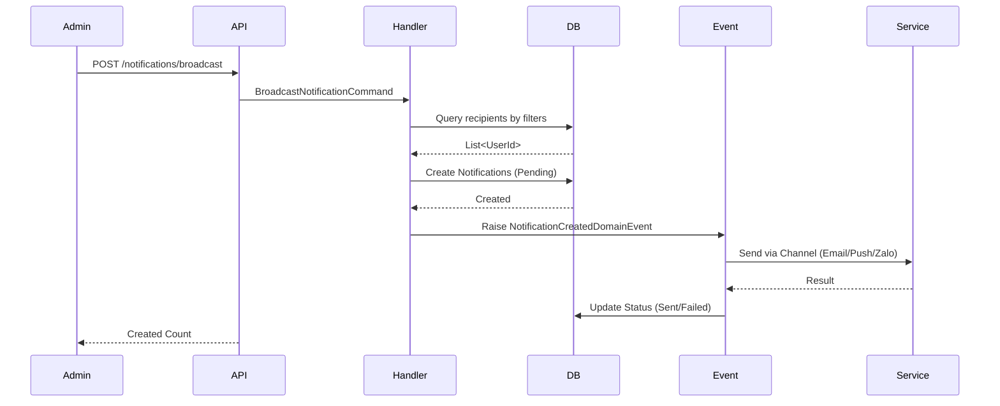
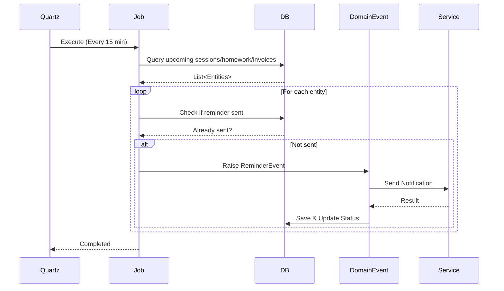

# Notification Flow Guide - Chi Tiết Toàn Bộ

## Mục lục
- [Tổng quan](#tổng-quan)
- [Kiến trúc tổng thể](#kiến-trúc-tổng-thể)
- [Các thành phần chính](#các-thành-phần-chính)
- [Flow xử lý chi tiết](#flow-xử-lý-chi-tiết)
- [Database Schema](#database-schema)
- [API Endpoints](#api-endpoints)
- [Domain Events](#domain-events)
- [Background Jobs](#background-jobs)
- [Push Notification Flow](#push-notification-flow)
- [Các loại Notification](#các-loại-notification)
- [Payload Format](#payload-format)
- [Error Handling](#error-handling)
- [Security](#security)
- [Best Practices](#best-practices)

---

## Tổng quan

Tài liệu này mô tả chi tiết flow xử lý notification trong hệ thống KidzGo, bao gồm:
- Gửi notification thủ công (broadcast)
- Gửi notification tự động (reminder jobs)
- Quản lý device tokens
- Quản lý templates

---

## Kiến trúc tổng thể

```
┌─────────────────────────────────────────────────────────────────────────────────┐
│                              CLIENTS                                           │
│  ┌─────────────┐    ┌─────────────┐    ┌─────────────┐    ┌─────────────┐    │
│  │   Mobile    │    │     Web     │    │   Tablet    │    │    Zalo     │    │
│  │  (iOS/Android)│   │  (Next.js)  │    │             │    │     OA      │    │
│  └──────┬──────┘    └──────┬──────┘    └──────┬──────┘    └──────┬──────┘    │
│         │                  │                  │                  │           │
│         ▼                  ▼                  ▼                  ▼           │
│  ┌─────────────────────────────────────────────────────────────────────────┐   │
│  │                    FIREBASE CLOUD MESSAGING (FCM)                      │   │
│  │                  APPLE PUSH NOTIFICATION SERVICE (APNS)                 │   │
│  └─────────────────────────────────────────────────────────────────────────┘   │
└─────────────────────────────────────────────────────────────────────────────────┘
                                       │
                                       ▼
┌─────────────────────────────────────────────────────────────────────────────────┐
│                              BACKEND                                            │
│  ┌─────────────────────────────────────────────────────────────────────────┐   │
│  │                        API GATEWAY / LOAD BALANCER                       │   │
│  └─────────────────────────────────────────────────────────────────────────┘   │
│                                       │                                         │
│                                       ▼                                         │
│  ┌─────────────────────────────────────────────────────────────────────────┐   │
│  │                         KidzGo.API (ASP.NET Core)                        │   │
│  │  ┌─────────────────────────────────────────────────────────────────────┐│   │
│  │  │                    NotificationController                            ││   │
│  │  │  - GET /notifications         - POST /notifications/broadcast      ││   │
│  │  │  - PATCH /notifications/{id}  - POST /notifications/device-token    ││   │
│  │  │  - POST /notifications/templates                                   ││   │
│  │  └─────────────────────────────────────────────────────────────────────┘│   │
│  └─────────────────────────────────────────────────────────────────────────┘   │
│                                       │                                         │
│                                       ▼                                         │
│  ┌─────────────────────────────────────────────────────────────────────────┐   │
│  │                      KidzGo.Application (MediatR)                      │   │
│  │  ┌──────────────┐ ┌──────────────┐ ┌──────────────┐ ┌──────────────┐  │   │
│  │  │  Broadcast   │ │    Get       │ │     Mark     │ │   Template   │  │   │
│  │  │  Notification│ │ Notifications│ │    As Read   │ │   Manager    │  │   │
│  │  └──────────────┘ └──────────────┘ └──────────────┘ └──────────────┘  │   │
│  └─────────────────────────────────────────────────────────────────────────┘   │
│                                       │                                         │
│                                       ▼                                         │
│  ┌─────────────────────────────────────────────────────────────────────────┐   │
│  │                     KidzGo.Infrastructure                               │   │
│  │  ┌──────────────────┐  ┌──────────────────┐  ┌──────────────────┐  │   │
│  │  │ PushNotification │  │    Quartz Jobs    │  │  Domain Events   │  │   │
│  │  │    Service       │  │ (Reminders)       │  │   Handler        │  │   │
│  │  └──────────────────┘  └──────────────────┘  └──────────────────┘  │   │
│  └─────────────────────────────────────────────────────────────────────────┘   │
│                                       │                                         │
│                                       ▼                                         │
│  ┌─────────────────────────────────────────────────────────────────────────┐   │
│  │                    KidzGo.Domain (Entities & Events)                    │   │
│  │  ┌────────────┐ ┌────────────┐ ┌────────────┐ ┌────────────┐          │   │
│  │  │Notification│ │DeviceToken │ │   Event    │ │  Template  │          │   │
│  │  └────────────┘ └────────────┘ └────────────┘ └────────────┘          │   │
│  └─────────────────────────────────────────────────────────────────────────┘   │
└─────────────────────────────────────────────────────────────────────────────────┘
                                       │
                                       ▼
┌─────────────────────────────────────────────────────────────────────────────────┐
│                           DATABASE                                              │
│  ┌─────────────────────────────────────────────────────────────────────────┐   │
│  │                           PostgreSQL                                     │   │
│  │  ┌──────────────┐ ┌──────────────┐ ┌──────────────┐ ┌──────────────┐   │   │
│  │  │ notifications│ │ device_tokens│ │notification_ │ │ email_       │   │   │
│  │  │              │ │              │ │ templates   │ │ templates    │   │   │
│  │  └──────────────┘ └──────────────┘ └──────────────┘ └──────────────┘   │   │
│  └─────────────────────────────────────────────────────────────────────────┘   │
└─────────────────────────────────────────────────────────────────────────────────┘
```

---

## Các thành phần chính

### 1. Domain Entities

#### Notification Entity
```csharp
// Kidzgo.Domain/Notifications/Notification.cs
public class Notification : Entity
{
    public Guid Id { get; set; }
    public Guid RecipientUserId { get; set; }
    public Guid? RecipientProfileId { get; set; }
    public NotificationChannel Channel { get; set; }        // InApp, ZaloOa, Push, Email
    public string Title { get; set; } = null!;
    public string? Content { get; set; }
    public string? Deeplink { get; set; }
    public NotificationStatus Status { get; set; }         // Pending, Sent, Failed
    public DateTime? SentAt { get; set; }
    public DateTime? ReadAt { get; set; }
    public string? TemplateId { get; set; }
    public DateTime CreatedAt { get; set; }
    
    // Metadata
    public string? TargetRole { get; set; }    // Parent, Student, Teacher, Staff
    public string? Kind { get; set; }          // report, attendance, homework, message, payment
    public string? Priority { get; set; }      // high, normal, low
    public string? SenderRole { get; set; }     // System, Teacher, Admin, Staff
    public string? SenderName { get; set; }
    
    // Navigation
    public User RecipientUser { get; set; } = null!;
    public Profile? RecipientProfile { get; set; }
}
```

#### DeviceToken Entity
```csharp
// Kidzgo.Domain/Users/DeviceToken.cs
public class DeviceToken : Entity
{
    public Guid Id { get; set; }
    public Guid UserId { get; set; }
    public string Token { get; set; } = null!;        // FCM token
    public string? DeviceType { get; set; }           // iOS, Android, Web
    public string? DeviceId { get; set; }
    public string? Role { get; set; }                 // Parent, Teacher, Staff, Admin
    public string? Browser { get; set; }              // Chrome, Firefox, Safari, Edge
    public string? Locale { get; set; }                // vi, en
    public Guid? BranchId { get; set; }
    public bool IsActive { get; set; }
    public DateTime CreatedAt { get; set; }
    public DateTime UpdatedAt { get; set; }
    public DateTime? LastUsedAt { get; set; }
}
```

#### NotificationTemplate Entity
```csharp
// Kidzgo.Domain/Notifications/NotificationTemplate.cs
public class NotificationTemplate : Entity
{
    public Guid Id { get; set; }
    public string Code { get; set; } = null!;          // Unique code: HOMEWORK_REMINDER, SESSION_REMINDER
    public NotificationChannel Channel { get; set; }  // InApp, Email, Push, ZaloOa
    public string Title { get; set; } = null!;
    public string Content { get; set; } = null!;
    public string? Placeholders { get; set; }          // JSON: {"studentName", "className", "date"}
    public bool IsActive { get; set; }
    public bool IsDeleted { get; set; }
    public DateTime CreatedAt { get; set; }
    public DateTime? UpdatedAt { get; set; }
}
```

### 2. Enums

```csharp
// NotificationChannel - Kênh gửi
public enum NotificationChannel
{
    InApp,    // Lưu vào DB, đọc qua API
    ZaloOa,  // Gửi qua Zalo Official Account
    Push,    // Gửi qua FCM/APNS
    Email     // Gửi qua email
}

// NotificationStatus - Trạng thái
public enum NotificationStatus
{
    Pending,  // Chờ gửi
    Sent,      // Đã gửi
    Failed     // Gửi thất bại
}
```

---

## Flow xử lý chi tiết

### Flow 1: Broadcast Notification (Admin gửi thủ công)

```
┌─────────────┐     ┌─────────────┐     ┌─────────────┐     ┌─────────────┐     ┌─────────────┐
│   Admin     │     │   API       │     │  MediatR   │     │  Database   │     │   Domain   │
│   Client    │────▶│ Controller  │────▶│  Handler    │────▶│   (Save)    │────▶│   Event     │
└─────────────┘     └─────────────┘     └─────────────┘     └─────────────┘     └──────┬──────┘
                                                                                              │
      ┌───────────────────────────────────────────────────────────────────────────────────────┘
      ▼
┌─────────────┐     ┌─────────────┐     ┌─────────────┐
│   Email     │     │     FCM     │     │   Zalo      │
│   Service   │     │   Service   │     │   Service   │
└─────────────┘     └─────────────┘     └─────────────┘
```

**Chi tiết từng bước:**

1. **Admin gọi API** `POST /api/notifications/broadcast`
2. **Controller nhận request** và chuyển thành Command
3. **Handler xử lý:**
   - Xác định danh sách người nhận theo các filter (role, branch, class, userIds, profileIds)
   - Tạo Notification records cho từng người nhận
   - Raise domain event `NotificationCreatedDomainEvent`
4. **Domain Event Handler:**
   - Kiểm tra channel (Email/Push/ZaloOa)
   - Gọi service tương ứng để gửi
5. **Cập nhật Status** sau khi gửi (Sent/Failed)

### Flow 2: Device Token Registration

```
┌─────────────┐     ┌─────────────┐     ┌─────────────┐     ┌─────────────┐
│   Client    │     │   API       │     │   Handler   │     │  Database   │
│  (Firebase) │────▶│ Controller  │────▶│             │────▶│             │
└─────────────┘     └─────────────┘     └─────────────┘     └─────────────┘
       │                   │                    │                    │
       │ FCM Token        │ RegisterDeviceToken │ Save/Update        │ DeviceToken
       │ Generated        │ Command             │ Token              │ Stored
       ▼                  ▼                    ▼                    ▼
┌─────────────┐     ┌─────────────┐     ┌─────────────┐     ┌─────────────┐
│  Firebase   │     │   Success   │     │    OK       │     │  isActive   │
│  Client     │     │   Response  │     │             │     │    = true   │
└─────────────┘     └─────────────┘     └─────────────┘     └─────────────┘
```

**Chi tiết:**

1. **Client nhận FCM token** từ Firebase SDK
2. **Gọi API** `POST /api/notifications/device-token` với:
   - `token`: FCM token
   - `deviceType`: iOS/Android/Web
   - `deviceId`: Device UUID (optional)
   - `role`: User role
   - `locale`: Language code
3. **Handler lưu/cập nhật** DeviceToken vào database
4. **Response thành công** về cho client

### Flow 3: Auto Reminder Jobs (Quartz)

```
┌─────────────────────────────────────────────────────────────────────────────────┐
│                           QUARTZ SCHEDULER                                      │
│                                                                                 │
│  ┌─────────────────────────────────────────────────────────────────────────┐   │
│  │              SendNotificationRemindersJob (Every 15 minutes)            │   │
│  └─────────────────────────────────────────────────────────────────────────┘   │
│                                        │                                        │
│         ┌──────────────────────────────┼──────────────────────────────┐      │
│         │                              │                              │      │
│         ▼                              ▼                              ▼      │
│  ┌──────────────┐            ┌──────────────┐            ┌──────────────┐ │
│  │   Session    │            │   Homework   │            │   Tuition    │ │
│  │   Reminder   │            │   Reminder   │            │   Reminder   │ │
│  │   (UC-331)   │            │   (UC-332)   │            │   (UC-333)   │ │
│  └──────────────┘            └──────────────┘            └──────────────┘ │
│         │                              │                              │      │
│         ▼                              ▼                              ▼      │
│  ┌──────────────┐            ┌──────────────┐            ┌──────────────┐ │
│  │   Makeup     │            │   Mission    │            │    Media     │ │
│  │   Reminder   │            │   Reminder   │            │   Reminder   │ │
│  │   (UC-334)   │            │   (UC-335)   │            │   (UC-336)   │ │
│  └──────────────┘            └──────────────┘            └──────────────┘ │
└─────────────────────────────────────────────────────────────────────────────────┘
                                        │
                                        ▼
                         ┌──────────────────────────┐
                         │   Raise Domain Events    │
                         │   (SessionReminder,      │
                         │    HomeworkReminder,     │
                         │    TuitionReminder...)    │
                         └──────────────────────────┘
                                        │
                                        ▼
                         ┌──────────────────────────┐
                         │   Event Handlers         │
                         │   (Send Email/Push/Zalo)  │
                         └──────────────────────────┘
```

**Reminder Windows (Configurable):**

| Loại | Thời điểm gửi |
|------|---------------|
| Session Reminder (UC-331) | 24 giờ trước giờ học |
| Homework Reminder (UC-332) | 24 giờ trước deadline |
| Tuition Reminder (UC-333) | 3 ngày trước due date |
| Makeup Reminder (UC-334) | 24 giờ trước buổi bù |
| Mission Reminder (UC-335) | 24 giờ trước deadline |
| Media Reminder (UC-336) | 1 giờ sau khi tạo media |

---

## Database Schema

### Tables

```sql
-- Notifications table
CREATE TABLE notifications (
    id UUID PRIMARY KEY DEFAULT gen_random_uuid(),
    recipient_user_id UUID NOT NULL REFERENCES users(id),
    recipient_profile_id UUID REFERENCES profiles(id),
    channel VARCHAR(50) NOT NULL, -- Email, Push, ZaloOa, InApp
    title VARCHAR(255) NOT NULL,
    content TEXT,
    deeplink VARCHAR(500),
    status VARCHAR(20) DEFAULT 'Pending', -- Pending, Sent, Failed
    sent_at TIMESTAMP,
    read_at TIMESTAMP,
    template_id VARCHAR(100),
    created_at TIMESTAMP DEFAULT NOW(),
    
    -- Metadata
    target_role VARCHAR(50),   -- Parent, Student, Teacher, Staff
    kind VARCHAR(50),          -- report, attendance, homework, message, payment
    priority VARCHAR(20),       -- high, normal, low
    sender_role VARCHAR(50),   -- System, Teacher, Admin, Staff
    sender_name VARCHAR(255)
);

-- Device tokens table
CREATE TABLE device_tokens (
    id UUID PRIMARY KEY DEFAULT gen_random_uuid(),
    user_id UUID NOT NULL REFERENCES users(id),
    token VARCHAR(500) NOT NULL,
    device_type VARCHAR(20),  -- iOS, Android, Web
    device_id VARCHAR(100),
    role VARCHAR(50),          -- Parent, Teacher, Staff, Admin
    browser VARCHAR(50),       -- Chrome, Firefox, Safari, Edge
    locale VARCHAR(10),         -- vi, en
    branch_id UUID REFERENCES branches(id),
    is_active BOOLEAN DEFAULT TRUE,
    created_at TIMESTAMP DEFAULT NOW(),
    updated_at TIMESTAMP DEFAULT NOW(),
    last_used_at TIMESTAMP,
    
    UNIQUE(token)
);

-- Notification templates table
CREATE TABLE notification_templates (
    id UUID PRIMARY KEY DEFAULT gen_random_uuid(),
    code VARCHAR(100) NOT NULL UNIQUE,
    channel VARCHAR(50) NOT NULL,
    title VARCHAR(255) NOT NULL,
    content TEXT NOT NULL,
    placeholders JSONB,
    is_active BOOLEAN DEFAULT TRUE,
    is_deleted BOOLEAN DEFAULT FALSE,
    created_at TIMESTAMP DEFAULT NOW(),
    updated_at TIMESTAMP
);

-- Email templates table
CREATE TABLE email_templates (
    id UUID PRIMARY KEY DEFAULT gen_random_uuid(),
    code VARCHAR(100) NOT NULL UNIQUE,
    subject VARCHAR(255) NOT NULL,
    body_html TEXT NOT NULL,
    body_text TEXT,
    placeholders JSONB,
    is_active BOOLEAN DEFAULT TRUE,
    is_deleted BOOLEAN DEFAULT FALSE,
    created_at TIMESTAMP DEFAULT NOW(),
    updated_at TIMESTAMP
);

-- Indexes
CREATE INDEX idx_notifications_user ON notifications(recipient_user_id);
CREATE INDEX idx_notifications_status ON notifications(status);
CREATE INDEX idx_notifications_created ON notifications(created_at DESC);
CREATE INDEX idx_device_tokens_user ON device_tokens(user_id);
CREATE INDEX idx_device_tokens_token ON device_tokens(token);
CREATE INDEX idx_device_tokens_active ON device_tokens(is_active);
```

---

## API Endpoints

### 1. Lấy danh sách Notifications

```
GET /api/notifications
```

**Query Parameters:**
| Tham số | Kiểu | Mặc định | Mô tả |
|---------|------|----------|-------|
| profileId | GUID | - | Lọc theo profile ID |
| unreadOnly | bool | - | Chỉ lấy notification chưa đọc |
| status | string | - | Lọc theo status (Pending/Sent/Failed) |
| pageNumber | int | 1 | Số trang |
| pageSize | int | 10 | Số lượng/trang |

**Response:**
```json
{
  "isSuccess": true,
  "data": {
    "items": [
      {
        "id": "uuid-here",
        "title": "Báo cáo tháng",
        "content": "Báo cáo tháng 2 đã có",
        "deeplink": "/portal/parent/reports/123",
        "status": "Sent",
        "channel": "InApp",
        "readAt": null,
        "createdAt": "2026-02-03T10:00:00Z"
      }
    ],
    "pageNumber": 1,
    "pageSize": 10,
    "totalCount": 50,
    "totalPages": 5
  }
}
```

### 2. Broadcast Notification (Admin)

```
POST /api/notifications/broadcast
```

**Authorization:** Admin, ManagementStaff

**Request Body:**
```json
{
  "title": "Thông báo bảo trì",
  "content": "Hệ thống sẽ bảo trì vào 22:00",
  "deeplink": "/portal/maintenance",
  "channel": "Push",           // InApp, Email, Push, ZaloOa
  "role": "Parent",            // Gửi theo role (Parent, Student, Teacher, Staff)
  "branchId": null,            // Lọc theo chi nhánh
  "classId": null,             // Lọc theo lớp
  "studentProfileId": null,    // Gửi cho học sinh cụ thể
  "userIds": [],               // Hoặc danh sách user cụ thể
  "profileIds": []            // Hoặc danh sách profile
}
```

**Response (201 Created):**
```json
{
  "isSuccess": true,
  "data": {
    "createdCount": 150,
    "createdNotificationIds": ["uuid1", "uuid2", ...]
  }
}
```

**Filter Priority:**
1. `userIds` (cao nhất)
2. `profileIds`
3. `studentProfileId`
4. `classId`
5. `branchId`
6. `role`
7. `channel` (thấp nhất - gửi tất cả)

### 3. Đánh dấu đã đọc

```
PATCH /api/notifications/{id}/read
```

**Response:**
```json
{
  "isSuccess": true,
  "data": {
    "id": "uuid-here",
    "readAt": "2026-02-03T10:30:00Z"
  }
}
```

### 4. Retry Notification thất bại

```
POST /api/notifications/{id}/retry
```

**Authorization:** Admin, ManagementStaff

### 5. Register Device Token

```
POST /api/notifications/device-token
```

**Request Body:**
```json
{
  "token": "fcm-token-from-firebase",
  "deviceType": "Web",      // iOS, Android, Web
  "deviceId": "device-uuid",
  "role": "Parent",
  "browser": "Chrome",
  "locale": "vi",
  "branchId": null
}
```

### 6. Delete Device Token

```
DELETE /api/notifications/device-token
```

**Request Body:**
```json
{
  "token": "fcm-token-to-delete"
}
```

### 7. Notification Templates CRUD

| Method | Endpoint | Mô tả |
|--------|----------|-------|
| GET | /api/notifications/templates | Danh sách templates |
| GET | /api/notifications/templates/{id} | Chi tiết template |
| POST | /api/notifications/templates | Tạo template |
| PUT | /api/notifications/templates/{id} | Cập nhật template |
| DELETE | /api/notifications/templates/{id} | Xóa mềm template |

**Create Template Request:**
```json
{
  "code": "SESSION_REMINDER_24H",
  "channel": "Email",
  "title": "Nhắc nhở buổi học",
  "content": "Em chào phụ huynh {{parentName}}, con {{studentName}} có buổi học {{className}} vào ngày {{date}} lúc {{time}} tại {{room}}.",
  "placeholders": ["parentName", "studentName", "className", "date", "time", "room"],
  "isActive": true
}
```

---

## Domain Events

### NotificationCreatedDomainEvent
```csharp
// Gửi khi admin tạo broadcast notification
public sealed class NotificationCreatedDomainEvent : DomainEvent
{
    public Guid NotificationId { get; }
    public NotificationChannel Channel { get; }
    // Properties: RecipientUserId, Title, Content, Deeplink, etc.
}
```

### SessionReminderDomainEvent (UC-331)
```csharp
// Tự động gửi 24h trước buổi học
public sealed class SessionReminderDomainEvent : DomainEvent
{
    public Guid SessionId { get; }
    public Guid UserId { get; }
    public Guid StudentProfileId { get; }
    public string ClassName { get; }
    public DateTime SessionDateTime { get; }
    public string? RoomName { get; }
}
```

### HomeworkReminderDomainEvent (UC-332)
```csharp
// Tự động gửi 24h trước deadline
public sealed class HomeworkReminderDomainEvent : DomainEvent
{
    public Guid HomeworkId { get; }
    public Guid UserId { get; }
    public Guid StudentProfileId { get; }
    public string HomeworkTitle { get; }
    public DateTime? DueAt { get; }
    public string? ClassName { get; }
}
```

### TuitionReminderDomainEvent (UC-333)
```csharp
// Tự động gửi 3 ngày trước due date
public sealed class TuitionReminderDomainEvent : DomainEvent
{
    public Guid InvoiceId { get; }
    public Guid UserId { get; }
    public Guid StudentProfileId { get; }
    public decimal Amount { get; }
    public DateTime DueDate { get; }
}
```

### MakeupReminderDomainEvent (UC-334)
```csharp
// Tự động gửi 24h trước buổi bù
```

### MissionReminderDomainEvent (UC-335)
```csharp
// Tự động gửi 24h trước deadline nhiệm vụ
```

### MediaReminderDomainEvent (UC-336)
```csharp
// Tự động gửi 1h sau khi có media mới
```

---

## Background Jobs

### SendNotificationRemindersJob

**Cron Expression:** `0 */15 * * * ?` (Every 15 minutes)

**Config (appsettings.json):**
```json
{
  "NotificationReminders": {
    "SessionReminderWindowHours": 24,
    "HomeworkReminderWindowHours": 24,
    "TuitionReminderWindowDays": 3,
    "MakeupReminderWindowHours": 24,
    "MissionReminderWindowHours": 24,
    "MediaReminderWindowMinutes": 60
  }
}
```

**Job Logic:**
```csharp
public async Task Execute(IJobExecutionContext context)
{
    var now = DateTime.UtcNow;
    
    // 1. Session Reminders (UC-331)
    await SendSessionRemindersAsync(db, now);
    
    // 2. Homework Reminders (UC-332)
    await SendHomeworkRemindersAsync(db, now);
    
    // 3. Tuition Reminders (UC-333)
    await SendTuitionRemindersAsync(db, now);
    
    // 4. Makeup Reminders (UC-334)
    await SendMakeupRemindersAsync(db, now);
    
    // 5. Mission Reminders (UC-335)
    await SendMissionRemindersAsync(db, now);
    
    // 6. Media Reminders (UC-336)
    await SendMediaRemindersAsync(db, now);
}
```

---

## Push Notification Flow

### 1. Client Side (Web)

```javascript
// Request Firebase token
import { getToken, onMessage } from 'firebase/messaging';

const messaging = getMessaging(firebaseApp);

// Lấy token
async function registerDevice() {
  const permission = await Notification.requestPermission();
  if (permission === 'granted') {
    const token = await getToken(messaging, {
      vapidKey: 'YOUR_VAPID_KEY'
    });
    
    // Gửi token lên server
    await fetch('/api/notifications/device-token', {
      method: 'POST',
      headers: {
        'Content-Type': 'application/json',
        'Authorization': `Bearer ${token}`
      },
      body: JSON.stringify({
        token: token,
        deviceType: 'Web',
        browser: 'Chrome',
        locale: 'vi'
      })
    });
  }
}

// Lắng nghe message khi app đang mở
onMessage(messaging, (payload) => {
  console.log('Message received:', payload);
  // Hiển thị notification hoặc cập nhật UI
});
```

### 2. Server Side

```csharp
// IPushNotificationService
public interface IPushNotificationService
{
    Task<bool> SendPushNotificationAsync(
        string deviceToken,
        string title,
        string body,
        Dictionary<string, string>? data = null,
        string? deeplink = null,
        CancellationToken cancellationToken = default);
        
    Task<Dictionary<string, bool>> SendPushNotificationsAsync(
        List<string> deviceTokens,
        string title,
        string body,
        Dictionary<string, string>? data = null,
        string? deeplink = null,
        CancellationToken cancellationToken = default);
}
```

### 3. Push Payload

**FCM Payload:**
```json
{
  "notification": {
    "title": "Báo cáo tháng đã công bố",
    "body": "Phụ huynh có thể xem báo cáo tháng 2."
  },
  "data": {
    "targetRole": "Parent",
    "kind": "report",
    "priority": "high",
    "senderRole": "Teacher",
    "senderName": "KidzGo Centre",
    "link": "/vi/portal/parent/notifications",
    "notification_id": "uuid-here",
    "deeplink": "/vi/portal/parent/notifications"
  },
  "webpush": {
    "fcm_options": {
      "link": "/vi/portal/parent/notifications"
    }
  }
}
```

---

## Các loại Notification

### 1. Real-time Notification
- **Mô tả:** Gửi ngay khi có sự kiện
- **Ví dụ:**
  - Báo cáo tháng mới được công bố
  - Thông báo nghỉ lớp
  - Thông báo thanh toán thành công

### 2. Scheduled Notification (Reminder Job)
- **Mô tả:** Gửi theo lịch tự động
- **Ví dụ:**
  - Nhắc nhở buổi học (24h trước)
  - Nhắc nhở nộp bài tập
  - Nhắc nhở đóng học phí
  - Nhắc nhở buổi học bù

### 3. In-App Notification
- **Mô tả:** Lưu vào database, hiển thị trong app
- **Kênh:** `InApp`
- **Đọc qua:** `GET /api/notifications`

### 4. Push Notification
- **Mô tả:** Gửi qua FCM/APNS
- **Kênh:** `Push`
- **Yêu cầu:** Device token đã đăng ký

### 5. Email Notification
- **Mô tả:** Gửi qua email
- **Kênh:** `Email`
- **Template:** Sử dụng notification templates

### 6. Zalo OA Notification
- **Mô tả:** Gửi qua Zalo Official Account
- **Kênh:** `ZaloOa`
- **Tích hợp:** Zalo API

---

## Payload Format

### Broadcast Request (Full)
```json
{
  "title": "Thông báo bảo trì hệ thống",
  "content": "Hệ thống KidzGo sẽ bảo trì vào 22:00 đến 23:00 ngày 15/02/2026.",
  "deeplink": "/portal/maintenance",
  "channel": "Push",
  "role": "Parent",
  "branchId": "uuid-of-branch",
  "classId": null,
  "studentProfileId": null,
  "userIds": [],
  "profileIds": []
}
```

### Device Token Registration
```json
{
  "token": "fcm-token-abc123",
  "deviceType": "Web",
  "deviceId": "device-uuid-xyz",
  "role": "Parent",
  "browser": "Chrome",
  "locale": "vi",
  "branchId": null
}
```

---

## Error Handling

| Error Code | Message | Mô tả |
|------------|---------|-------|
| 400 | Invalid payload | Dữ liệu request không hợp lệ |
| 401 | Unauthorized | Chưa xác thực |
| 403 | Forbidden | Không có quyền |
| 404 | User not found | Người dùng không tồn tại |
| 422 | No recipients | Không có người nhận nào phù hợp với filter |
| 429 | Rate limit exceeded | Quá giới hạn gửi notification |
| 500 | Internal server error | Lỗi server |

### Business Errors (Domain)
```csharp
public static class NotificationErrors
{
    public static readonly Error InvalidFilters = Error.New(
        "Notification.InvalidFilters", 
        "At least one filter must be specified");
        
    public static readonly Error NoRecipients = Error.New(
        "Notification.NoRecipients", 
        "No recipients found for the specified filters");
        
    public static readonly Error NotificationNotFound = Error.New(
        "Notification.NotFound", 
        "Notification not found");
}
```

---

## Security

1. **Authentication:**
   - Tất cả API (trừ device-token) yêu cầu JWT token
   - Broadcast notification chỉ Admin và ManagementStaff mới được gọi

2. **Input Validation:**
   - Validate tất cả input
   - Sanitize HTML trong content

3. **Rate Limiting:**
   - Giới hạn số lượng broadcast/ngày
   - Giới hạn số notification/user/ngày

4. **Token Security:**
   - Device token được lưu hashed (optional)
   - Token cũ được deactivate khi user logout

5. **Sensitive Data:**
   - Không gửi sensitive data trong push payload
   - Sử dụng HTTPS cho tất cả API

---

## Best Practices

### 1. Batch Notifications
- FCM hỗ trợ tối đa **500 tokens/batch**
- Gom nhiều notification thành batch để giảm API calls

### 2. Retry Logic
- Implement exponential backoff khi gửi thất bại
- Retry tối đa 3 lần
- Sau 3 lần thất bại, đánh dấu status = Failed

### 3. Deduplication
- Kiểm tra notification đã gửi trước khi gửi reminder
- Sử dụng composite key: `{sessionId}_{userId}`

### 4. Device Token Management
- Xóa token khi user logout
- Deactivate token cũ khi user đăng nhập thiết bị mới
- Clean up token không hoạt động > 6 tháng

### 5. Unsubscribe
- Cho phép user tắt notification từng loại
- Lưu preferences vào database
- Respect DND (Do Not Disturb) hours

### 6. Logging & Monitoring
- Log đầy đủ để debug
- Track delivery rate
- Alert khi failure rate > 5%

---

## Firebase Configuration

### Backend (appsettings.json)
```json
{
  "FCM": {
    "ServiceAccountPath": "path/to/firebase-service-account.json",
    "ServiceAccountJson": null
  }
}
```

### Frontend (Next.js)
```env
NEXT_PUBLIC_FIREBASE_API_KEY=your-api-key
NEXT_PUBLIC_FIREBASE_AUTH_DOMAIN=your-project.firebaseapp.com
NEXT_PUBLIC_FIREBASE_PROJECT_ID=your-project-id
NEXT_PUBLIC_FIREBASE_STORAGE_BUCKET=your-project.appspot.com
NEXT_PUBLIC_FIREBASE_MESSAGING_SENDER_ID=your-sender-id
NEXT_PUBLIC_FIREBASE_APP_ID=your-app-id
NEXT_PUBLIC_FIREBASE_VAPID_KEY=your-vapid-key
```

---

## Use Cases Mapping

| UC Code | Use Case | Trigger | Channel |
|---------|----------|---------|---------|
| UC-325 | Xem danh sách notifications | User login | InApp |
| UC-326 | Quản lý templates | Admin | InApp |
| UC-327 | Cập nhật templates | Admin | InApp |
| UC-331 | Nhắc nhở buổi học | Quartz Job (24h before) | Email |
| UC-332 | Nhắc nhở bài tập | Quartz Job (24h before) | Email, Push |
| UC-333 | Nhắc nhở đóng học phí | Quartz Job (3 days before) | Email, Push |
| UC-334 | Nhắc nhở học bù | Quartz Job (24h before) | Email |
| UC-335 | Nhắc nhở nhiệm vụ | Quartz Job (24h before) | Push |
| UC-336 | Thông báo media mới | Quartz Job (1h after) | Push |
| UC-338 | Xem trạng thái notification | User | InApp |
| UC-339 | Retry notification failed | Admin | All |

---

## Flow Charts (Mermaid)

### Broadcast Flow


### Reminder Job Flow


---

## Appendix: Code References

### Controller
```0:0:Kidzgo.API/Controllers/NotificationController.cs
```

### Domain Entities
```0:0:Kidzgo.Domain/Notifications/Notification.cs
```
```0:0:Kidzgo.Domain/Users/DeviceToken.cs
```
```0:0:Kidzgo.Domain/Notifications/NotificationTemplate.cs
```

### Request Models
```0:0:Kidzgo.API/Requests/BroadcastNotificationRequest.cs
```
```0:0:Kidzgo.API/Requests/RegisterDeviceTokenRequest.cs
```

### Application Handlers
```0:0:Kidzgo.Application/Notifications/BroadcastNotification/BroadcastNotificationCommandHandler.cs
```

### Background Jobs
```0:0:Kidzgo.Infrastructure/BackgroundJobs/SendNotificationRemindersJob.cs
```

### Push Service Interface
```0:0:Kidzgo.Application/Abstraction/Services/IPushNotificationService.cs
```

---

## Liên hệ hỗ trợ

- Email: support@kidzgo.com
- Hotline: 1900 xxxx
api-support- Slack: #
